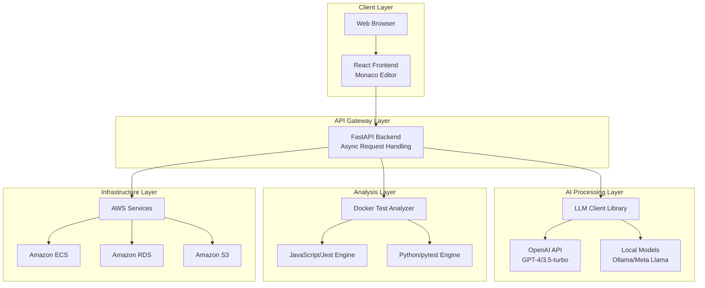
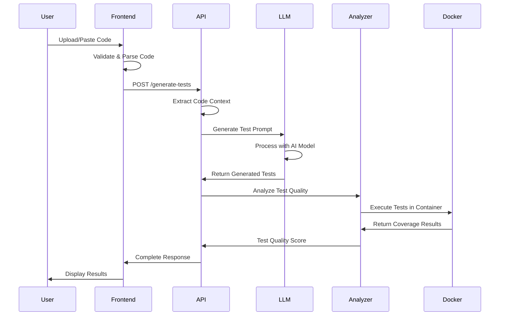

# Unit Cloud Gen - AI-Powered Unit Test Generation Platform

A comprehensive, modern web application that leverages Large Language Models (LLMs) to automatically generate high-quality unit tests for source code across multiple programming languages. The platform combines the power of AI with robust test analysis capabilities to provide developers with an intelligent testing solution.

## 🏗️ System Architecture Overview

Unit Cloud Gen follows a microservices architecture pattern with clear separation of concerns across frontend, backend, AI processing, and test analysis layers. The system is designed for scalability, reliability, and extensibility.



## 🔄 Data Flow Architecture

### 1. Code Input & Processing Flow



### 2. Request/Response Cycle

#### Phase 1: Code Analysis & Preparation

```
User Code Input → Language Detection → Context Extraction → Dependency Analysis
```

#### Phase 2: AI-Powered Test Generation

```
Prompt Engineering → Model Selection → AI Processing → Test Code Generation
```

#### Phase 3: Quality Evaluation & Analysis

```
Docker Container Setup → Test Execution → Coverage Analysis → Quality Scoring
```

#### Phase 4: Result Delivery

```
Response Formatting → Frontend Rendering → User Interaction
```

## 🧩 Component Architecture

### Frontend Architecture (React + TypeScript)

```
src/
├── components/
│   ├── CodeGenerator.tsx      # Main code input interface
│   ├── GeneratedCode.tsx      # Test output display
│   ├── Header.tsx             # Navigation & branding
│   ├── Results.tsx            # Analysis results display
│   └── ui/                    # Reusable UI components
├── assets/
│   └── defaultCode.ts         # Language templates
├── lib/                       # Utility functions
└── App.tsx                    # Main application component
```

**Key Features:**

- **Monaco Editor Integration**: Professional code editing with syntax highlighting
- **Real-time Validation**: Instant feedback on code syntax and structure
- **Responsive Design**: Mobile-first approach with TailwindCSS
- **Theme Management**: Dark/light mode with smooth transitions
- **State Management**: React hooks for efficient state handling

### Backend Architecture (Python FastAPI)

```
backend/
├── app/
│   └── main.py                # FastAPI application entry point
├── llm_client/               # LLM integration library
│   ├── base_client.py        # Abstract base client
│   ├── openai_client.py      # OpenAI API integration
│   └── local_client.py       # Local model integration
├── test_analyzer/            # Test execution & analysis
│   ├── TestAnalyzer.py       # Main analyzer orchestrator
│   ├── jest_analyzer.py      # JavaScript/Jest analyzer
│   ├── python_analyzer.py    # Python/pytest analyzer
│   └── docker_client.py      # Docker container management
└── test_generator.py         # Core test generation logic
```

**Architecture Patterns:**

- **Async/Await**: Non-blocking request handling for high performance
- **Dependency Injection**: Modular LLM client selection
- **Factory Pattern**: Dynamic analyzer creation based on language
- **Strategy Pattern**: Multiple AI provider support
- **Observer Pattern**: Progress tracking and status updates

### LLM Client Library Architecture

```python
# Unified Interface for Multiple AI Providers
class BaseLLMClient(ABC):
    @abstractmethod
    async def generate_completion(self, prompt: str) -> str:
        pass

    @abstractmethod
    async def generate_chat(self, messages: List[dict]) -> str:
        pass
```

**Supported Integrations:**

- **OpenAI Client**: GPT-4, GPT-3.5-turbo with API key authentication
- **Local Client**: Meta Llama/CodeLlama via Ollama or PyTorch
- **Future Support**: Anthropic Claude, Google PaLM, open-source models

**Key Features:**

- Model caching and optimization
- Quantization support for resource efficiency
- Error handling and retry mechanisms
- Cost tracking and usage analytics
- Context window management

### Test Analyzer Architecture

```python
# Docker-based Isolated Test Execution
class TestAnalyzer:
    def __init__(self, language: str):
        self.docker_client = DockerClient()
        self.analyzer = self._create_analyzer(language)

    async def analyze_tests(self, code: str, tests: str) -> AnalysisResult:
        container = await self._create_container()
        result = await self._execute_tests(container, code, tests)
        await self._cleanup_container(container)
        return result
```

**Docker Container Strategy:**

- **Language-Specific Images**: Optimized containers for each supported language
- **Security Isolation**: Sandboxed execution prevents system access
- **Resource Management**: CPU/memory limits and timeout controls
- **Artifact Collection**: Coverage files and execution logs
- **Cleanup Automation**: Automatic container disposal after analysis

## 🔧 Technical Implementation Details

### AI Prompt Engineering

```python
# Language-Specific Test Generation Prompts
PROMPT_TEMPLATES = {
    "javascript": """
    Generate comprehensive Jest unit tests for the following JavaScript code:

    Code to test:
    {code}

    Requirements:
    - Use Jest testing framework
    - Include edge cases and error scenarios
    - Mock external dependencies
    - Achieve high test coverage
    - Follow Jest best practices
    """,

    "python": """
    Generate comprehensive pytest unit tests for the following Python code:

    Code to test:
    {code}

    Requirements:
    - Use pytest framework
    - Include fixtures for setup/teardown
    - Test edge cases and exceptions
    - Mock external dependencies using pytest-mock
    - Follow Python testing best practices
    """
}
```

### Docker Test Execution

```dockerfile
# JavaScript/Jest Container
FROM node:18-alpine
RUN npm install -g jest @types/jest
WORKDIR /app
COPY entrypoint.sh /entrypoint.sh
RUN chmod +x /entrypoint.sh
ENTRYPOINT ["/entrypoint.sh"]

# Python/pytest Container
FROM python:3.9-slim
RUN pip install pytest pytest-cov pytest-mock
WORKDIR /app
COPY entrypoint.sh /entrypoint.sh
RUN chmod +x /entrypoint.sh
ENTRYPOINT ["/entrypoint.sh"]
```

### Coverage Analysis Integration

```bash
# JavaScript Coverage Collection
jest --coverage --coverageDirectory=/tmp/coverage --coverageReporters=json

# Python Coverage Collection
pytest --cov=. --cov-report=json:/tmp/coverage/coverage.json
```

## 🚀 Deployment Architecture

### AWS Cloud Infrastructure

```
Production Environment:
├── Amazon ECS Cluster
│   ├── Frontend Service (React SPA)
│   ├── Backend Service (FastAPI)
│   └── Auto Scaling Groups
├── Amazon RDS PostgreSQL
│   ├── User data & preferences
│   ├── Usage analytics
│   └── Model performance metrics
├── Amazon S3 Buckets
│   ├── Static frontend assets
│   ├── Code samples & templates
│   └── Analysis artifacts
├── Amazon CloudFront CDN
├── Application Load Balancer
└── Route 53 DNS Management
```

### Local Development Setup

```yaml
# docker-compose.yml
version: "3.8"
services:
  frontend:
    build: ./frontend
    ports: ["5173:5173"]
    volumes: ["./frontend:/app"]

  backend:
    build: ./backend
    ports: ["8000:8000"]
    volumes: ["./backend:/app"]
    environment:
      - OPENAI_API_KEY=${OPENAI_API_KEY}

  postgres:
    image: postgres:13
    environment:
      POSTGRES_DB: unitcloudgen
      POSTGRES_USER: dev
      POSTGRES_PASSWORD: dev
```

## 🛡️ Security Architecture

### Multi-Layer Security Approach

1. **Input Validation**: Comprehensive code sanitization and validation
2. **Container Isolation**: Docker sandboxing for test execution
3. **API Security**: Rate limiting, CORS policies, and input sanitization
4. **Infrastructure Security**: VPC isolation, security groups, and IAM policies
5. **Data Protection**: Encryption at rest and in transit

### Code Execution Safety

```python
# Resource Limits for Docker Containers
CONTAINER_LIMITS = {
    "memory": "512m",
    "cpu": "0.5",
    "timeout": 30,  # seconds
    "network": "none",  # No network access
    "readonly": True    # Read-only filesystem
}
```

## 📊 Performance Architecture

### Optimization Strategies

1. **Async Processing**: Non-blocking I/O for high concurrency
2. **Caching**: Model response caching and static asset optimization
3. **Load Balancing**: Horizontal scaling with ECS services
4. **Database Optimization**: Connection pooling and query optimization
5. **CDN Integration**: Global content delivery for static assets

### Monitoring & Analytics

```python
# Performance Metrics Collection
class MetricsCollector:
    def track_generation_time(self, start_time: float, end_time: float):
        duration = end_time - start_time
        self.metrics.histogram("test_generation_duration", duration)

    def track_model_usage(self, model: str, tokens: int):
        self.metrics.counter(f"model_usage.{model}", tokens)

    def track_test_quality(self, score: float):
        self.metrics.gauge("test_quality_score", score)
```

## 🔄 Integration Architecture

### AI Provider Integration

```python
# Dynamic Model Selection
class LLMClientFactory:
    @staticmethod
    def create_client(provider: str, model: str) -> BaseLLMClient:
        if provider == "openai":
            return OpenAIClient(model=model)
        elif provider == "local":
            return LocalClient(model=model)
        else:
            raise ValueError(f"Unsupported provider: {provider}")
```

### Future Integration Points

- **IDE Plugins**: VS Code, IntelliJ IDEA extensions
- **CI/CD Integration**: GitHub Actions, Jenkins, GitLab CI
- **Team Collaboration**: Slack/Discord bots, team dashboards
- **Enterprise Features**: SSO, audit logging, compliance reporting

## 📈 Scalability Architecture

### Horizontal Scaling Strategy

1. **Stateless Services**: All services designed for horizontal scaling
2. **Load Distribution**: Multiple backend instances with load balancing
3. **Database Scaling**: Read replicas and connection pooling
4. **Container Orchestration**: ECS auto-scaling based on CPU/memory usage
5. **CDN Optimization**: Global edge locations for content delivery

### Resource Management

```python
# Dynamic Resource Allocation
class ResourceManager:
    def __init__(self):
        self.docker_pool = DockerPool(max_containers=10)
        self.llm_clients = LRUCache(maxsize=5)

    async def get_analyzer(self, language: str):
        return await self.docker_pool.acquire(language)

    async def get_llm_client(self, provider: str):
        return self.llm_clients.get_or_create(provider)
```

## 🎯 Quality Assurance Architecture

### Multi-Dimensional Quality Scoring

```python
class TestQualityEvaluator:
    def calculate_quality_score(self, analysis_result: AnalysisResult) -> float:
        metrics = {
            "coverage_score": analysis_result.line_coverage * 0.3,
            "complexity_score": self._evaluate_test_complexity(analysis_result) * 0.2,
            "assertion_quality": self._evaluate_assertions(analysis_result) * 0.3,
            "error_handling": self._evaluate_error_cases(analysis_result) * 0.2
        }
        return sum(metrics.values())
```

This comprehensive architecture ensures Unit Cloud Gen delivers reliable, scalable, and high-quality AI-powered unit test generation while maintaining security, performance, and extensibility for future enhancements.

## Project Structure

```
.
├── terraform/               # Infrastructure as Code
│   ├── main.tf             # Main Terraform configuration
│   ├── variables.tf        # Variable definitions
│   ├── outputs.tf          # Output definitions
│   └── modules/            # Terraform modules
│       ├── network/        # Network infrastructure
│       ├── compute/        # Compute resources
│       └── database/       # Database resources
├── frontend/               # React (Vite) frontend
│   ├── src/               # Source code
│   ├── public/            # Static assets
│   └── package.json       # Frontend dependencies
├── backend/               # Python FastAPI backend
│   ├── app/              # Application code
│   ├── llm_client/       # LLM integration library
│   ├── test_analyzer/    # Docker-based test analysis
│   ├── requirements.txt   # Python dependencies
│   └── test_generator.py  # Core test generation logic
└── docker-compose.yml    # Local development setup
```

## Prerequisites

- Terraform >= 1.0.0
- AWS CLI configured with appropriate credentials
- Docker and Docker Compose
- Node.js >= 16.x
- Python >= 3.9
- OpenAI API key (for cloud models) or Ollama setup (for local models)

## Getting Started

### Infrastructure Setup

1. Clone the repository
2. Configure AWS credentials
3. Initialize Terraform:

   ```bash
   cd terraform
   terraform init
   ```

4. Review the deployment plan:

   ```bash
   terraform plan
   ```

5. Apply the infrastructure:

   ```bash
   terraform apply
   ```

### Local Development

1. Set up environment variables:

   ```bash
   export OPENAI_API_KEY=your_openai_api_key
   ```

2. Start the development environment:

   ```bash
   docker-compose up
   ```

3. Access the application:
   - Frontend: <http://localhost:5173>
   - Backend API: <http://localhost:8000>
   - API Documentation: <http://localhost:8000/docs>

## Features

### Core Capabilities

- **Multi-Language Support**: JavaScript, TypeScript, Python (Java, Go, Rust planned)
- **AI-Powered Generation**: OpenAI GPT models and local Meta Llama/CodeLlama
- **Quality Analysis**: Docker-based test execution with coverage reporting
- **Professional Editor**: Monaco editor with syntax highlighting and IntelliSense
- **Real-time Feedback**: Instant validation and progress tracking

### Advanced Features

- **Provider Selection**: Choose between cloud and local AI models
- **Coverage Metrics**: Line, branch, and function coverage analysis
- **Quality Scoring**: AI-powered test effectiveness evaluation (1-10 scale)
- **Performance Tracking**: Token usage, cost estimation, generation timing
- **Dark/Light Mode**: Accessible design with smooth theme transitions

## Infrastructure

The application is deployed on AWS using:

- **Amazon ECS**: Container orchestration for scalable deployment
- **Amazon RDS**: PostgreSQL database for user data and analytics
- **Amazon S3**: File storage for code samples and analysis artifacts
- **Amazon CloudFront**: Global CDN for fast content delivery
- **Amazon Route 53**: DNS management and health checks
- **AWS Certificate Manager**: SSL/TLS certificate management
- **Application Load Balancer**: High availability and traffic distribution

## Contributing

1. Fork the repository
2. Create a feature branch (`git checkout -b feature/amazing-feature`)
3. Commit your changes (`git commit -m 'Add amazing feature'`)
4. Push to the branch (`git push origin feature/amazing-feature`)
5. Create a Pull Request

## License

MIT License - see [LICENSE](LICENSE) file for details.
